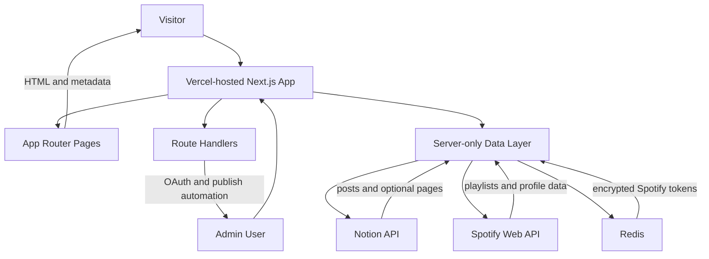

# Architecture

## Overview

The system is a single Next.js application deployed on Vercel. Public pages are rendered through App Router pages with static regeneration where appropriate, while server-only modules integrate with Notion, Spotify, and Redis.

## System Diagram

## Key Components

- `app/`
  - Public routes for home, writing, writing detail, playlists, about, and admin.
  - Metadata routes for RSS, sitemap, and robots.
  - Route handlers for Spotify login, callback, logout, and publishing automation.

- `components/site/`
  - Shared site UI including navigation, footer, cards, theme toggle, loading states, and identity-driven presentation components.

- `components/notion/`
  - Rendering layer for Notion rich text and supported block types.

- `lib/notion/`
  - Notion client setup, database querying, page property mapping, slug generation, and recursive block hydration.

- `lib/spotify/`
  - Public playlist fetching and caching for the playlists section.

- `lib/spotify-admin/`
  - Spotify OAuth, cookie-backed admin session handling, token encryption, Redis persistence, token refresh, and monthly publish automation.

- `lib/site-config.ts`
  - Central configuration for metadata, fallback copy, URLs, and social links.

## Core Data Flows

### Writing

1. Public routes call `lib/notion/getDatabase.ts` to read published posts from the Notion posts database.
2. Post summaries are mapped from Notion properties and sorted by publish date.
3. Writing detail pages fetch recursive block content through `getPageBlocks`.
4. Next.js serves these routes with periodic regeneration.

### Playlists

1. Public playlist routes call `getCachedPlaylists`.
2. The cached function loads the stored Spotify token, refreshes it if necessary, and fetches playlists from Spotify.
3. Results are filtered to `eimertunes` playlists and rendered on static pages with hourly cache refresh.

### Spotify Admin Automation

1. Admin login starts at `/api/admin/spotify/login`.
2. Spotify redirects back to the callback route with OAuth parameters.
3. The callback validates signed state, exchanges the authorization code, verifies the expected Spotify account, encrypts the token, stores it in Redis, and creates a signed admin session cookie.
4. The admin page can trigger the publish route directly, or the same route can be called by an external scheduler using a bearer secret.
5. The publish job scans playlists, filters to `eimertunes`, skips playlists not owned by the configured account, and sets eligible playlists to public.

## Deployment Model

- Runtime hosting: Vercel.
- External services:
  - Notion API for writing content and optional page content.
  - Spotify Web API for public playlists and admin automation.
  - Redis for encrypted Spotify token storage.
- CI: GitHub Actions runs `npm ci` and `npm run check` on pushes and pull requests to `main`.

## Constraints and Risks

- The app depends on external content and API providers, so invalid credentials or missing environment variables degrade content or admin functionality.
- Public playlist rendering depends on a valid stored Spotify token, which ties public playlist freshness to the private admin authentication flow.
- Page sourcing is mixed today: writing is Notion-backed, while some pages such as `About` are still local app content.
- Redis and Vercel configuration live outside the repository, so infrastructure setup is only partially represented in version control.
- The Notion renderer supports a focused subset of block types, so unsupported blocks fall back gracefully rather than rendering with full fidelity.
